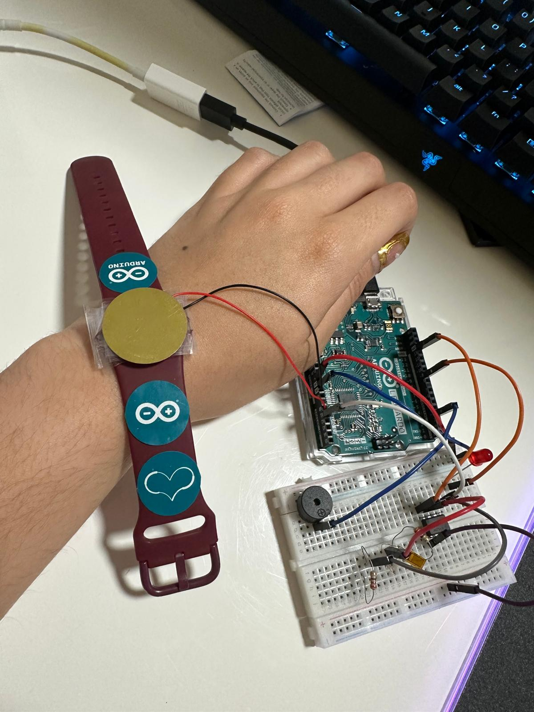
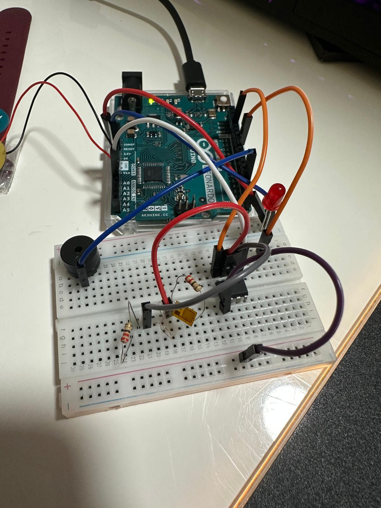

# Piezoelectric Respiration Monitoring System (MATLAB)

## Overview
This project implements a respiration monitoring system using a piezoelectric
sensor and a temperature sensor. MATLAB was used for signal processing,
visualization, and respiration rate extraction.

## Data
The dataset includes raw and processed sensor measurements from piezoelectric
and temperature sensors recorded during controlled breathing.

## Tools
- MATLAB
- Arduino
- Piezoelectric sensor
- Temperature sensor

## Methods
The MATLAB analysis pipeline includes:
1. Baseline calibration of piezoelectric and temperature sensor signals
2. Signal filtering to reduce noise and motion artifacts
3. Peak detection for identification of respiratory cycles
4. Respiration rate calculation based on detected signal peaks

## Results

## Hardware Prototype

### Wearable Configuration

### Circuit Implementation

